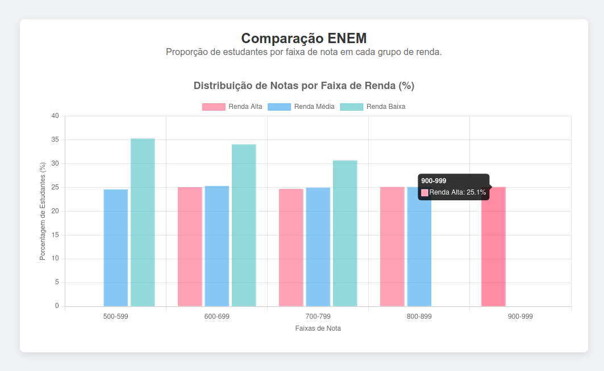

# EnemMetrics

## Status do Projeto
**Tracer Bullet 1: Concluída**

Este projeto utiliza a abordagem "Tracer Bullet" (Projétil Rastreador) para validar a arquitetura e o fluxo de dados antes de processar a base completa do ENEM. O objetivo desta primeira etapa foi estabelecer a comunicação entre um backend Python e um frontend React, exibindo dados mockados de comparação de notas por renda.

## Funcionalidades Implementadas
- **Backend API**: Endpoint funcional que gera dados mockados simulando a desigualdade de notas por faixa de renda.
- **Frontend Dashboard**: Interface React que consome a API e renderiza um gráfico de barras interativo.
- **Integração**: Comunicação CORS configurada entre FastAPI e React.

## Preview


## Tecnologias Utilizadas
- **Backend**: Python 3.x, FastAPI, Uvicorn.
- **Frontend**: React (Vite), Chart.js, react-chartjs-2, Axios.
- **Estilização**: CSS Puro (Flexbox), seguindo princípios de design minimalista.

## Pré-requisitos
- Python 3.10+ instalado.
- Node.js (npm) instalado.

## Como Executar

Este projeto requer que o Backend e o Frontend rodem simultaneamente em terminais separados.

### 1. Backend (FastAPI)
No terminal raiz do projeto:

```bash
# Instale as dependências (inclui uvicorn)
pip install "fastapi[standard]"

# Execute o servidor
fastapi dev main.py
```
O servidor iniciará em `http://127.0.0.1:8000`.

### 2. Frontend (React)
Em um novo terminal, acesse a pasta do frontend (se houver uma) ou a raiz onde está o `package.json`:

```bash
# Instale as dependências
npm install

# Execute a aplicação
npm run dev
```
A aplicação iniciará em `http://localhost:5173`.

## Estrutura de Pastas (Simplificada)
- `main.py`: Configuração do FastAPI, CORS e lógica de mock de dados.
- `src/components/GraficoEnem.jsx`: Componente React responsável por buscar dados e renderizar o gráfico.
- `src/App.jsx`: Layout principal e centralização do conteúdo.

## Endpoints da API

`GET /api/comparacao/nota-renda`

Retorna um JSON estruturado para gráficos, contendo labels (faixas de nota) e datasets (rendas).

**Exemplo de Resposta:**
```json
{
  "labels": ["500-599", "600-699", "700-799", "800-899", "900-999"],
  "datasets": [
    { "label": "Renda Alta", "data": [0, 25.05, 25.61, 24.54, 24.8] },
    { "label": "Renda Média", "data": [24.75, 25.74, 25.71, 23.8, 0] },
    { "label": "Renda Baixa", "data": [32.14, 33.3, 34.57, 0, 0] }
  ]
}
```

## Próximos Passos (Roadmap)
- **Dados Reais**: Substituir a função `generate_mock_data` pela leitura do arquivo CSV real do ENEM.
- **Deploy**: Configurar ambiente de produção (Docker/Cloud).
- **Novos Filtros**: Adicionar filtros para região, escola pública/privada e ano.