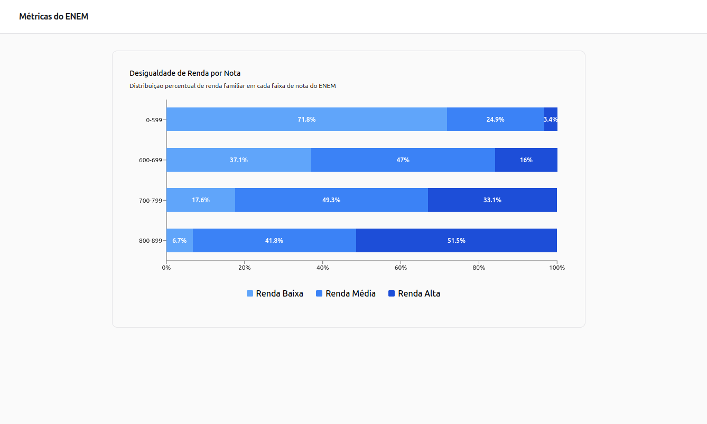

# EnemMetrics
Plataforma de análise de dados do ENEM focada em identificar correlações socioeconômicas e desigualdades educacionais. O projeto processa milhões de registros dos microdados reais para gerar insights visuais.

## Status do Projeto: Versão 1.0
**Tracer Bullet 2: Concluída**

A fase de "Tracer Bullet", saindo de um protótipo para uma aplicação real, foi concluída com sucesso. O sistema agora opera com dados reais do ENEM 2023, utilizando um pipeline ETL otimizado e um banco de dados relacional.

## Preview


## Tecnologias Utilizadas

### **Data Engineering (ETL)**
- **Python 3.10+**
- **Polars**: Manipulação de dados de alta performance (superior ao Pandas para grandes volumes).
- **ADBC (Arrow Database Connectivity)**: Para inserção ultra-rápida no PostgreSQL.

### **Backend**
- **FastAPI**: API assíncrona de alta performance.
- **PostgreSQL**: Banco de dados relacional (via Docker).
- **Psycopg 3**: Driver assíncrono para conexão com o banco.

### **Frontend**
- **React 19 + TypeScript**
- **Vite**: Tooling rápido para o frontend.
- **Tailwind CSS & Shadcn UI**: Estilização e componentes modernos.
- **Recharts**: Visualização de dados interativa.
## Pré-requisitos
- Python 3.10+ instalado.
- Node.js (npm) instalado.

---

## Arquitetura do Sistema

1.  **Camada de Dados**: Banco de dados PostgreSQL rodando em container Docker.
2.  **Pipeline ETL**:
    *   **Extração**: Lê o CSV original do INEP (2023).
    *   **Transformação**: Filtra apenas alunos presentes, calcula a média das 5 notas e categoriza a renda familiar em faixas (Baixa, Média, Alta).
    *   **Carga**: Limpa a tabela e insere os dados transformados no banco.
3.  **API**: Fornece endpoints que executam consultas agregadas no PostgreSQL para o frontend.
4.  **Dashboard**: Interface que exibe a distribuição percentual de renda por faixa de nota.

---

## Pré-requisitos
- Docker e Docker Compose.
- Python 3.10 ou superior.
- Node.js 18 ou superior.
- Microdados do ENEM 2023 (arquivo `MICRODADOS_ENEM_2023.csv`) dentro da pasta `/data/`.

---

## Como Executar

### 1. Banco de Dados (Docker)
Suba o container do PostgreSQL:
```bash
docker-compose up -d
```

### 2. Pipeline ETL (Processamento dos Dados)
Nesta etapa, os dados brutos são transformados e enviados ao banco:
```bash
cd etl
pip install -r requirements.txt
python3 main_etl.py
```

### 3. Backend (API)
Inicie o servidor da API:
```bash
cd backend
pip install -r requirements.txt
uvicorn src.main:app --reload
```
A API estará disponível em `http://127.0.0.1:8000`.

### 4. Frontend (Dashboard)
Inicie a interface web:
```bash
cd frontend
npm install
npm run dev
```
Acesse `http://localhost:5173`.

---

## Endpoints Principais

`GET /api/metricas/renda`

Retorna a distribuição percentual de cada categoria de renda em diferentes faixas de nota (ex: 0-599, 600-699, etc).

**Exemplo de Resposta:**
```json
{
  "dados": [
    {
      "faixa_nota": "700-799",
      "qtd_renda_baixa": 1240,
      "pct_renda_baixa": 15.5,
      "pct_renda_media": 45.2,
      "pct_renda_alta": 39.3,
      "total_notas": 8000
    }
  ]
}
```

---

## Próximos Passos
- [ ] Adicionar filtros por Estado (UF).
- [ ] Implementar comparação entre Escola Pública vs Privada.
- [ ] Criar visualização de mapa de calor por região.
- [ ] Dockerizar as aplicações de Backend e Frontend.

---

## License

Distribuído sob a licença MIT. Consulte o arquivo [LICENSE](./LICENSE) para obter mais informações.